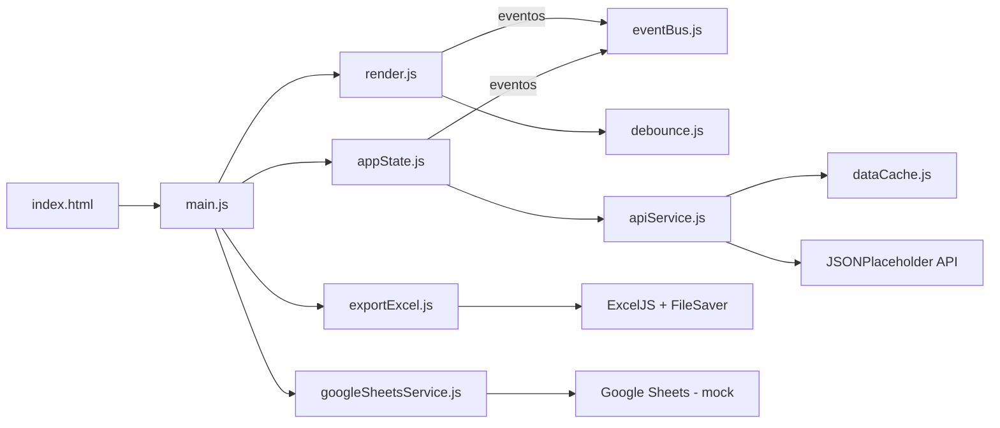

# Test Case — Automação de Análise de Engajamento (Desafio Event-Driven)

Aplicação front-end em **JavaScript puro (Vanilla JS + ES Modules)** que consulta uma API pública, calcula métricas de engajamento de usuários com base em filtros de qualidade definidos pelo próprio usuário, exibe os resultados em tempo real e gera um relatório executivo em Excel — com uma etapa adicional de sincronização (simulada) com Google Sheets.

O projeto foi construído seguindo uma **arquitetura orientada a eventos (Event-Driven Architecture)**, desacoplando a camada de interface da camada de regras de negócio através de um Event Bus central.

---

## 📋 Sumário

- [Arquitetura do Sistema](#arquitetura-do-sistema)
- [Fluxo de Eventos](#fluxo-de-eventos)
- [Endpoints da API](#endpoints-da-api)
- [Linguagens, Bibliotecas e Ferramentas](#linguagens-bibliotecas-e-ferramentas)
- [Decisões Técnicas](#decisoes-tecnicas)
- [Problemas e Soluções](#problemas-e-solucoes)
- [Testes](#testes)
- [Estrutura de Pastas](#estrutura-de-pastas)
- [Como Executar](#como-executar)

---

<a id="arquitetura-do-sistema"></a>

## 🏗️ Arquitetura do Sistema

A aplicação é dividida em camadas com responsabilidades bem definidas, que **não se conhecem diretamente**, a comunicação entre a camada de estado (regra de negócio) e a camada de interface acontece exclusivamente através do `EventBus`.



> Legenda: `main.js` orquestra View (`render.js`), State (`appState.js`) e as integrações de saída (`exportExcel.js`, `googleSheetsService.js`). View e State só se comunicam através do `eventBus.js`. Detalhes de cada camada na tabela abaixo.

**Camadas:**

| Camada | Arquivo | Responsabilidade |
|---|---|---|
| Orquestração | `src/main.js` | Inicializa a aplicação, conecta os módulos e coordena o fluxo de geração de relatório |
| View | `src/ui/render.js` | Manipula o DOM: renderiza métricas, mensagens de loading e erro |
| Estado / Regra de Negócio | `src/store/appState.js` | Mantém o estado atual (usuário, posts, filtros) e calcula as métricas |
| Comunicação | `src/events/eventBus.js` | Implementa o padrão Pub/Sub para desacoplar State e View |
| Acesso a Dados | `src/api/apiService.js` | Consome a API JSONPlaceholder (usuários, posts, comentários) |
| Cache | `src/cache/dataCache.js` | Cache em memória (singleton) para evitar chamadas repetidas |
| Integração Externa | `src/api/googleSheetsService.js` | Serviço isolado de sincronização com Google Sheets |
| Utilitários | `src/utils/debounce.js`, `src/utils/exportExcel.js` | Debounce de inputs e geração do arquivo `.xlsx` |

Essa separação segue o princípio de **Single Responsibility**: cada módulo faz uma única coisa, o que facilita testes isolados (ver seção [Testes](#-testes)) e permite trocar qualquer peça (ex.: trocar a API, trocar a lib de Excel) sem impactar as demais.

---

<a id="fluxo-de-eventos"></a>

## 🔄 Fluxo de Eventos

O núcleo da arquitetura é o `EventBus`, uma implementação simples de Pub/Sub (`on` para assinar, `emit` para publicar). Isso evita que `render.js` (View) precise importar `appState.js` (regra de negócio) para saber quando atualizar a tela — ele apenas escuta eventos.

### Eventos emitidos pela aplicação

| Evento | Emitido por | Escutado por | Payload |
|---|---|---|---|
| `LOADING_START` | `appState.loadUser()` | `render.js` | — |
| `LOADING_END` | `appState.loadUser()` | `render.js` | — |
| `METRICS_UPDATED` | `appState.calculateMetrics()` | `render.js`, `main.js` | objeto com `userId`, `userName`, `quantidadePosts`, `mediaCaracteres`, `mediaComentarios`, `isUserActive` |
| `ERROR` | `appState.loadUser()` (catch) | `render.js` | string com a mensagem de erro |

### Passo a passo do fluxo principal

```mermaid
sequenceDiagram
    participant U as Usuário
    participant UI as render.js
    participant State as appState.js
    participant Bus as eventBus.js
    participant API as apiService.js

    U->>UI: Seleciona um usuário no <select>
    UI->>State: loadUser(userId, userName)
    State->>Bus: emit(LOADING_START)
    Bus->>UI: notifica ouvintes
    UI-->>U: exibe "Carregando..."
    State->>API: getPostsAndComments(userId)
    API-->>State: posts + comentários (cache ou rede)
    State->>State: calculateMetrics()
    State->>Bus: emit(METRICS_UPDATED, metrics)
    Bus->>UI: notifica ouvintes
    Bus->>UI: main.js também escuta e guarda "latestMetrics"
    UI-->>U: renderiza métricas na tela
    State->>Bus: emit(LOADING_END)
```



1. O usuário escolhe um perfil no `<select>` → `render.js` chama `appState.loadUser()`.
2. `appState` emite `LOADING_START`; `render.js` reage exibindo a mensagem de carregamento.
3. `appState` busca posts/comentários via `apiService` (que primeiro consulta o `dataCache`; só faz `fetch` se não houver dado em memória).
4. `appState.calculateMetrics()` aplica os filtros de qualidade (mínimo de caracteres e mínimo de posts) e emite `METRICS_UPDATED` com o resultado.
5. Dois ouvintes reagem ao mesmo evento de forma independente: `render.js` atualiza o DOM, e `main.js` guarda o resultado em uma variável local (`latestMetrics`) para uso posterior no botão de relatório.
6. Se o usuário digitar nos campos de filtro, o `debounce` (300ms) evita recálculo a cada tecla; após a pausa, `appState.updateFilters()` roda e reemite `METRICS_UPDATED`.
7. Se a busca falhar, `appState` emite `ERROR` e `render.js` mostra a mensagem em vermelho.
8. Ao clicar em **"Gerar Relatório Executivo"**, `main.js` executa em sequência: geração do Excel (`downloadExcel`, com a lista de todos os usuários já analisados via `appState.getAllMetrics()`) → envio do relatório via POST real ao JSONPlaceholder (`postReport`) → sincronização simulada com Google Sheets (`sendToGoogleSheets`), atualizando o texto do botão a cada etapa para dar feedback visual ao usuário.
9. Se a busca inicial de usuários (Task 1) falhar, `main.js` também emite `ERROR` no `eventBus` — antes esse caso só gerava um `console.error` silencioso; agora reaproveita o mesmo canal de erro usado no restante da aplicação, mantendo o comportamento consistente.

---

<a id="endpoints-da-api"></a>

## 🔌 Endpoints da API

### API real consumida — JSONPlaceholder

Todas as chamadas abaixo são feitas por `src/api/apiService.js`, sempre passando primeiro pelo `dataCache.js` (só há requisição de rede em caso de cache miss).

| Endpoint | Método | Descrição | Parâmetros |
|---|---|---|---|
| `https://jsonplaceholder.typicode.com/users` | `GET` | Lista todos os usuários, usada para popular o `<select>` inicial | — |
| `https://jsonplaceholder.typicode.com/posts` | `GET` | Lista os posts de um usuário específico | Query string `userId={id}` |
| `https://jsonplaceholder.typicode.com/comments` | `GET` | Lista os comentários de um post específico (disparada em paralelo, uma vez por post, via `Promise.all`) | Query string `postId={id}` |
| `https://jsonplaceholder.typicode.com/posts` | `POST` | Simula o envio do relatório (Task 5). O JSONPlaceholder é uma API fake que **não persiste nada de verdade** — sempre responde `201` com um `id` simulado — então continua sendo uma simulação de envio, mas exercitando um POST real | Body: objeto com as métricas calculadas (`reportData`) |

**Cache:** as respostas de `/users` e de `/posts?userId={id}` ficam em memória (`apiCache`) com as chaves `all_users` e `posts_user_{id}`, respectivamente — evitando refazer a mesma requisição ao alternar entre usuários já consultados.

### Endpoint simulado (mock) — contrato para produção

O desafio não fornece credenciais reais de Google Apps Script, então a sincronização com Google Sheets é simulada com `setTimeout`, mas com o contrato de requisição já definido em código (comentado), pronto para ser ativado quando houver uma URL de deploy real.

| Endpoint (mock) | Método | Onde está no código | Corpo enviado (body) | Resposta simulada |
|---|---|---|---|---|
| `https://script.google.com/macros/s/AKfycbz_MOCK_URL/exec` (URL fictícia) | `POST`, `mode: 'no-cors'` | `googleSheetsService.js` → `sendToGoogleSheets(metrics)` | `JSON.stringify(metrics)`, header `Content-Type: application/json` | `true` após 800ms (simulando latência do Google Apps Script) |

> **Nota de revisão:** na primeira versão, `postReport` também era um `setTimeout` fixo, sem nenhuma requisição real. Isso cumpria a letra do requisito ("simular o envio"), mas deixava o requisito técnico "Consumo de API (GET e POST)" satisfeito apenas parcialmente (só havia GET real). A versão atual faz um POST de verdade para `/posts` do JSONPlaceholder — que é fake e não persiste nada — resolvendo os dois pontos ao mesmo tempo.

> A implementação real da chamada `fetch` para o Google Apps Script já está escrita dentro de `sendToGoogleSheets` (comentada), documentando exatamente a estrutura de requisição que seria usada em produção assim que uma URL de deploy real estivesse disponível.

---

<a id="linguagens-bibliotecas-e-ferramentas"></a>

## 🛠️ Linguagens, Bibliotecas e Ferramentas

| Ferramenta | Uso no projeto |
|---|---|
| **JavaScript (ES2020+, ES Modules)** | Linguagem principal, sem uso de framework (Vanilla JS) |
| **HTML5 / CSS3** | Estrutura e estilização da interface |
| **[JSONPlaceholder](https://jsonplaceholder.typicode.com)** | API REST pública usada como fonte de dados fake (usuários, posts, comentários) |
| **[ExcelJS](https://github.com/exceljs/exceljs)** (via CDN) | Geração do relatório executivo em `.xlsx` no navegador, incluindo cards de KPI, formatação condicional (data bars) e múltiplas abas |
| **[FileSaver.js](https://github.com/eligrey/FileSaver.js)** (via CDN) | Disparo do download do arquivo Excel gerado em memória (Blob) |
| **Google Apps Script WebApp** (mockado) | Ponto de integração simulado para sincronização com Google Sheets (requisito diferencial do desafio) |
| **[Jest 30](https://jestjs.io/)** + **jest-environment-jsdom** | Testes unitários, de integração e de performance |
| **Node.js / npm** | Ambiente de execução e gerenciamento de dependências de teste |

Não há bundler (Webpack/Vite) — o projeto roda com módulos ES nativos do navegador (`type="module"`), o que elimina a necessidade de etapa de build.

---

<a id="decisoes-tecnicas"></a>

## 🎯 Decisões Técnicas

- **Event Bus em vez de acoplamento direto:** `render.js` e `appState.js` nunca se importam mutuamente. Toda comunicação passa pelo `eventBus`, o que demonstra o padrão Pub/Sub exigido pelo desafio e permite adicionar novos "ouvintes" (ex.: um log, uma notificação) sem tocar no código existente.

- **Cache em memória (`dataCache.js`) como módulo isolado:** em vez de colocar `if/else` de cache dentro do `apiService`, o cache foi extraído para uma classe própria (`DataCache`), reforçando responsabilidade única e possibilitando testá-lo separadamente (`apiCache.has/get/set/clear`).

- **Debounce de 300ms nos filtros:** os campos "mínimo de caracteres" e "mínimo de posts" recalculam métricas a cada alteração. Sem debounce, cada tecla digitada dispararia um recálculo completo. A função genérica `debounce()` evita processamento desnecessário e melhora a responsividade percebida.

- **Padrão Singleton para `eventBus`, `appState` e `apiCache`:** como a aplicação tem um único estado global (não há múltiplas instâncias de usuário rodando em paralelo), exportar uma instância única de cada classe simplifica o acoplamento entre módulos sem a necessidade de um contêiner de injeção de dependência.

- **`postReport` faz um POST real (não é mais um `setTimeout` fixo):** como o JSONPlaceholder é uma API fake que não persiste nada, um POST real para `/posts` continua sendo, na prática, uma simulação do envio — mas agora exercita de fato o ciclo requisição → resposta → erro (inclusive testado com cenário de falha HTTP em `apiService.test.js`), em vez de apenas resolver uma promessa fixa depois de um tempo.

- **`googleSheetsService.js` fica mockado por decisão, não por limitação:** diferente do relatório (que usa `/posts` do JSONPlaceholder, uma API pública fake), a integração com Sheets exigiria um Apps Script implantado com uma URL própria. Colocar essa URL real em código versionado num repositório público exporia um endpoint aberto — qualquer pessoa com acesso ao repo poderia enviar dados para a planilha indefinidamente, mesmo depois do processo seletivo terminar. Como o item é um diferencial opcional e o case não fornece credenciais nem exige prova de execução ao vivo, o mock foi mantido como **módulo isolado e pronto para produção**, com o código real da chamada `fetch` escrito e comentado dentro do arquivo — documentando o padrão de integração sem expor um webhook pessoal publicamente.

- **Relatório consolida todos os usuários analisados na sessão, não só o selecionado:** `appState` mantém um `Map` (`analyzedUsers`) que registra a última métrica calculada de cada usuário à medida que ele é selecionado. A aba "Dashboard" do Excel continua mostrando o snapshot do usuário atualmente selecionado (KPIs grandes, gráfico de barras), mas a aba "Dados do Sistema" agora lista uma linha por usuário já analisado — o que corresponde melhor à ideia de "relatório" pedida na Task 4, já que a Task 1 carrega todos os usuários da base.

- **Geração de Excel no client-side com ExcelJS via CDN:** como não há bundler, as libs de terceiros (ExcelJS, FileSaver) foram carregadas via `<script>` no `index.html`, evitando a complexidade de configurar um empacotador apenas para duas dependências pontuais.

- **Proteção contra divisão por zero em `calculateMetrics()`:** quando nenhum post atende ao filtro de caracteres mínimos, as médias retornam `0` em vez de `NaN`, garantindo que a interface nunca exiba um valor inválido.

- **Feedback sequencial no botão de relatório:** como a geração do relatório envolve três operações assíncronas (Excel, POST simulado, Sheets simulado), o texto do botão muda a cada etapa ("Gerando Excel..." → "Enviando dados..." → "Sincronizando Sheets..." → "Relatório Concluído!") e fica desabilitado durante o processo, evitando cliques duplicados e deixando o usuário informado sobre o progresso.

---

<a id="problemas-e-solucoes"></a>

## 🐞 Problemas e Soluções

| Problema | Solução adotada |
|---|---|
| Recalcular métricas a cada tecla digitada nos filtros gerava processamento excessivo e piorava a UX | Implementação de um `debounce()` genérico (300ms), testado com timers falsos do Jest (`jest.useFakeTimers`) |
| Divisão por zero (`NaN`) quando nenhum post do usuário atendia ao filtro mínimo de caracteres | Guarda condicional em `calculateMetrics()`: se `quantidadePosts === 0`, retorna `0` em vez de calcular a média; comportamento coberto por teste dedicado |
| Chamadas repetidas à API ao trocar entre os mesmos usuários várias vezes, gerando latência e tráfego desnecessário | Cache em memória (`dataCache.js`) chaveado por `all_users` e `posts_user_{id}`, verificado antes de qualquer `fetch` |
| Ausência de backend real e de credenciais do Google Apps Script para o requisito diferencial (sincronização com Sheets) | Isolamento da integração em `googleSheetsService.js`, simulando a latência de rede (`setTimeout`) e mantendo comentado o código real de produção, para que a troca do mock pela chamada real seja direta |
| Múltiplas etapas assíncronas no botão "Gerar Relatório" deixavam o usuário sem noção do que estava acontecendo | Atualização textual do botão a cada etapa do processo, com bloqueio (`disabled`) durante a execução e restauração automática após 2,5s |
| Risco de a aplicação travar a interface ao processar grandes volumes de posts | Validado via teste de performance dedicado, garantindo o processamento de 100.000 posts em menos de 50ms com a abordagem de `filter`/`forEach` usada em `calculateMetrics()` |
| Testar código que manipula o DOM (`render.js`) sem um navegador real | Uso de `jest-environment-jsdom` para simular o DOM em ambiente Node, permitindo testes de integração que emitem eventos reais no `eventBus` e verificam o HTML resultante |
| `calculateMetrics()` tinha uma guarda inconsistente: retornava em silêncio (sem emitir `METRICS_UPDATED`) quando `this.posts.length === 0`, mesmo com um usuário selecionado, deixando a UI travada na última métrica exibida | Guarda simplificada para checar apenas `!this.currentUserId` — a proteção contra divisão por zero já existente no cálculo das médias cobre o caso de zero posts corretamente |
| O relatório em Excel só incluía o usuário selecionado no momento do clique, mesmo a Task 1 carregando todos os usuários da base | `appState` passou a manter um histórico (`analyzedUsers`) de todos os usuários já analisados na sessão; `exportExcel.js` agora recebe essa lista e gera uma linha por usuário na aba "Dados do Sistema" |
| Falha no carregamento inicial de usuários (Task 1) só gerava um `console.error`, sem nenhum feedback visível ao usuário | `main.js` passou a emitir o evento `ERROR` também nesse ponto, reaproveitando o mesmo canal já usado para falhas de carregamento de posts |
| `postReport` era apenas um `setTimeout` resolvendo um objeto fixo — não exercitava uma requisição de verdade nem tinha caminho de erro | Passou a fazer um POST real para `/posts` do JSONPlaceholder (API fake que não persiste dados), cumprindo de fato o requisito técnico "Consumo de API (GET e POST)" e permitindo testar o cenário de falha HTTP |

---

<a id="testes"></a>

## 🧪 Testes

O projeto utiliza **Jest** com módulos ES nativos (`--experimental-vm-modules`). A suíte cobre quatro frentes:

| Arquivo | Tipo | O que valida |
|---|---|---|
| `tests/apiService.test.js` | Unitário/Integração | Busca de usuários via `fetch` mockado e comportamento do cache (hit/miss) |
| `tests/appState.test.js` | Unitário | Regras de negócio: cálculo de médias, filtro de posts, proteção contra divisão por zero |
| `tests/debounce.test.js` | Unitário | Comportamento do debounce com timers falsos |
| `tests/integration.test.js` | Integração (jsdom) | Reação da UI a eventos reais emitidos no `eventBus` (métricas e erros) |
| `tests/performance.test.js` | Performance/Carga | Processamento de 100.000 posts em menos de 50ms |

Para rodar os testes:

```bash
npm install
npm test
```

---

<a id="estrutura-de-pastas"></a>

## 📁 Estrutura de Pastas

```
desafio-event-driven/
├── index.html
├── package.json
├── frontend/
│   └── style.css
├── src/
│   ├── main.js                  # Orquestrador da aplicação
│   ├── api/
│   │   ├── apiService.js        # Consumo da API JSONPlaceholder + cache
│   │   └── googleSheetsService.js  # Integração (mockada) com Google Sheets
│   ├── cache/
│   │   └── dataCache.js         # Cache em memória (singleton)
│   ├── events/
│   │   └── eventBus.js          # Pub/Sub central da aplicação
│   ├── store/
│   │   └── appState.js          # Estado e regras de negócio
│   ├── ui/
│   │   └── render.js            # Manipulação do DOM
│   └── utils/
│       ├── debounce.js
│       └── exportExcel.js          # Geração do relatório em Excel
        └── metricsCalculator.js
└── tests/
    ├── apiService.test.js
    ├── appState.test.js
    ├── debounce.test.js
    ├── integration.test.js
    └── performance.test.js
```

---

<a id="como-executar"></a>

## 🚀 Como Executar

Como o projeto usa **módulos ES nativos** (`<script type="module">`), não é possível abrir o `index.html` diretamente no navegador (`file://`) — isso esbarra em restrições de CORS do navegador para módulos. É necessário servir os arquivos por um servidor HTTP local. Abaixo estão duas formas rápidas e padrão de mercado para subir a aplicação.

### Opção 1: VS Code + Live Server (a mais rápida)

Se você estiver usando o Visual Studio Code como IDE:

1. Vá na aba de extensões e instale a extensão **Live Server** (autor: Ritwick Dey).
2. Abra o arquivo `index.html`.
3. Clique no botão **"Go Live"** no canto inferior direito do VS Code (ou clique com o botão direito no HTML e escolha **"Open with Live Server"**).
4. O navegador abrirá automaticamente em algo como `http://127.0.0.1:5500`.

### Opção 2: Node.js

Se você tem o Node.js instalado, abra o terminal na raiz do projeto e rode:

```bash
npx serve
```

O terminal vai te devolver um endereço (geralmente `http://localhost:3000`) — basta abrir no navegador.

> Alternativa equivalente, caso prefira Python: `python -m http.server 8000` e acesse `http://localhost:8000`.

### 🧪 Rodando os testes automatizados

O projeto já vem com o **Jest** configurado no `package.json` (dependência, suporte a ES Modules e o script de teste já estão prontos no repositório) — não é preciso instalar o Jest manualmente nem rodar `npm init`. Basta instalar as dependências e rodar a suíte:

```bash
npm install
npm test
```

Isso executa os 5 arquivos de teste descritos na seção [Testes](#-testes): regras de negócio, cache, debounce, integração com a UI (via jsdom) e o teste de performance com 100.000 posts.
