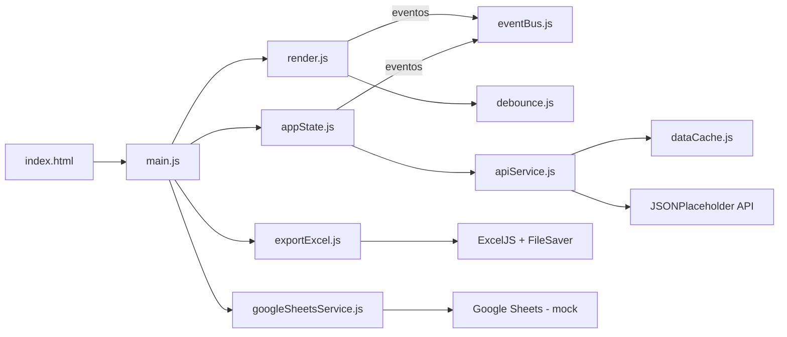

# Test Case — Automação de Análise de Engajamento (Desafio Event-Driven)

Aplicação front-end em **JavaScript puro (Vanilla JS + ES Modules)** que consulta uma API pública, calcula métricas de engajamento de usuários com base em filtros de qualidade definidos pelo próprio usuário, exibe os resultados em tempo real e gera um relatório executivo em Excel — com uma etapa adicional de sincronização (simulada) com Google Sheets.

O projeto foi construído seguindo uma **arquitetura orientada a eventos (Event-Driven Architecture)**, desacoplando a camada de interface da camada de regras de negócio através de um Event Bus central.

---

## 📋 Sumário

- [Arquitetura do Sistema](#-arquitetura-do-sistema)
- [Fluxo de Eventos](#-fluxo-de-eventos)
- [Linguagens, Bibliotecas e Ferramentas](#-linguagens-bibliotecas-e-ferramentas)
- [Decisões Técnicas](#-decisões-técnicas)
- [Problemas e Soluções](#-problemas-e-soluções)
- [Testes](#-testes)
- [Estrutura de Pastas](#-estrutura-de-pastas)
- [Como Executar](#-como-executar)

---

## 🏗️ Arquitetura do Sistema

A aplicação é dividida em camadas com responsabilidades bem definidas, que **não se conhecem diretamente** — a comunicação entre a camada de estado (regra de negócio) e a camada de interface acontece exclusivamente através do `EventBus`.



> Legenda: `main.js` orquestra View (`render.js`), State (`appState.js`) e as integrações de saída (`exportExcel.js`, `googleSheetsService.js`). View e State só se comunicam através do `eventBus.js`. Detalhes de cada camada na tabela abaixo.

**Camadas:**

| Camada | Arquivo | Responsabilidade |
|---|---|---|
| Orquestração | `src/main.js` | Inicializa a aplicação, conecta os módulos e coordena o fluxo de geração de relatório |
| View | `src/ui/render.js` | Manipula o DOM: renderiza métricas, mensagens de loading e erro |
| Estado / Regra de Negócio | `src/store/appState.js` | Mantém o estado atual (usuário, posts, filtros) e calcula as métricas |
| Comunicação | `src/events/eventBus.js` | Implementa o padrão Pub/Sub para desacoplar State e View |
| Acesso a Dados | `src/api/apiService.js` | Consome a API JSONPlaceholder (usuários, posts, comentários) |
| Cache | `src/cache/dataCache.js` | Cache em memória (singleton) para evitar chamadas repetidas |
| Integração Externa | `src/api/googleSheetsService.js` | Serviço isolado de sincronização com Google Sheets |
| Utilitários | `src/utils/debounce.js`, `src/utils/exportExcel.js` | Debounce de inputs e geração do arquivo `.xlsx` |

Essa separação segue o princípio de **Single Responsibility**: cada módulo faz uma única coisa, o que facilita testes isolados (ver seção [Testes](#-testes)) e permite trocar qualquer peça (ex.: trocar a API, trocar a lib de Excel) sem impactar as demais.

---

## 🔄 Fluxo de Eventos

O núcleo da arquitetura é o `EventBus`, uma implementação simples de Pub/Sub (`on` para assinar, `emit` para publicar). Isso evita que `render.js` (View) precise importar `appState.js` (regra de negócio) para saber quando atualizar a tela — ele apenas escuta eventos.

### Eventos emitidos pela aplicação

| Evento | Emitido por | Escutado por | Payload |
|---|---|---|---|
| `LOADING_START` | `appState.loadUser()` | `render.js` | — |
| `LOADING_END` | `appState.loadUser()` | `render.js` | — |
| `METRICS_UPDATED` | `appState.calculateMetrics()` | `render.js`, `main.js` | objeto com `userId`, `userName`, `quantidadePosts`, `mediaCaracteres`, `mediaComentarios`, `isUserActive` |
| `ERROR` | `appState.loadUser()` (catch) | `render.js` | string com a mensagem de erro |

### Passo a passo do fluxo principal

1. O usuário escolhe um perfil no `<select>` → `render.js` chama `appState.loadUser()`.
2. `appState` emite `LOADING_START`; `render.js` reage exibindo a mensagem de carregamento.
3. `appState` busca posts/comentários via `apiService` (que primeiro consulta o `dataCache`; só faz `fetch` se não houver dado em memória).
4. `appState.calculateMetrics()` aplica os filtros de qualidade (mínimo de caracteres e mínimo de posts) e emite `METRICS_UPDATED` com o resultado.
5. Dois ouvintes reagem ao mesmo evento de forma independente: `render.js` atualiza o DOM, e `main.js` guarda o resultado em uma variável local (`latestMetrics`) para uso posterior no botão de relatório.
6. Se o usuário digitar nos campos de filtro, o `debounce` (300ms) evita recálculo a cada tecla; após a pausa, `appState.updateFilters()` roda e reemite `METRICS_UPDATED`.
7. Se a busca falhar, `appState` emite `ERROR` e `render.js` mostra a mensagem em vermelho.
8. Ao clicar em **"Gerar Relatório Executivo"**, `main.js` executa em sequência: geração do Excel (`downloadExcel`) → envio simulado do relatório (`postReport`) → sincronização simulada com Google Sheets (`sendToGoogleSheets`), atualizando o texto do botão a cada etapa para dar feedback visual ao usuário.

---

## 🛠️ Linguagens, Bibliotecas e Ferramentas

| Ferramenta | Uso no projeto |
|---|---|
| **JavaScript (ES2020+, ES Modules)** | Linguagem principal, sem uso de framework (Vanilla JS) |
| **HTML5 / CSS3** | Estrutura e estilização da interface |
| **[JSONPlaceholder](https://jsonplaceholder.typicode.com)** | API REST pública usada como fonte de dados fake (usuários, posts, comentários) |
| **[ExcelJS](https://github.com/exceljs/exceljs)** (via CDN) | Geração do relatório executivo em `.xlsx` no navegador, incluindo cards de KPI, formatação condicional (data bars) e múltiplas abas |
| **[FileSaver.js](https://github.com/eligrey/FileSaver.js)** (via CDN) | Disparo do download do arquivo Excel gerado em memória (Blob) |
| **Google Apps Script WebApp** (mockado) | Ponto de integração simulado para sincronização com Google Sheets (requisito diferencial do desafio) |
| **[Jest 30](https://jestjs.io/)** + **jest-environment-jsdom** | Testes unitários, de integração e de performance |
| **Node.js / npm** | Ambiente de execução e gerenciamento de dependências de teste |

Não há bundler (Webpack/Vite) — o projeto roda com módulos ES nativos do navegador (`type="module"`), o que elimina a necessidade de etapa de build.

---

## 🎯 Decisões Técnicas

- **Event Bus em vez de acoplamento direto:** `render.js` e `appState.js` nunca se importam mutuamente. Toda comunicação passa pelo `eventBus`, o que demonstra o padrão Pub/Sub exigido pelo desafio e permite adicionar novos "ouvintes" (ex.: um log, uma notificação) sem tocar no código existente.

- **Cache em memória (`dataCache.js`) como módulo isolado:** em vez de colocar `if/else` de cache dentro do `apiService`, o cache foi extraído para uma classe própria (`DataCache`), reforçando responsabilidade única e possibilitando testá-lo separadamente (`apiCache.has/get/set/clear`).

- **Debounce de 300ms nos filtros:** os campos "mínimo de caracteres" e "mínimo de posts" recalculam métricas a cada alteração. Sem debounce, cada tecla digitada dispararia um recálculo completo. A função genérica `debounce()` evita processamento desnecessário e melhora a responsividade percebida.

- **Padrão Singleton para `eventBus`, `appState` e `apiCache`:** como a aplicação tem um único estado global (não há múltiplas instâncias de usuário rodando em paralelo), exportar uma instância única de cada classe simplifica o acoplamento entre módulos sem a necessidade de um contêiner de injeção de dependência.

- **Serviços mockados (`googleSheetsService.js` e `postReport`):** como o desafio não fornece credenciais reais de backend nem de Google Apps Script, essas integrações foram implementadas como simulações (`setTimeout` representando latência de rede), mas mantidas como **módulos isolados e prontos para produção** — o código real da chamada `fetch` para o Google Apps Script está escrito e comentado dentro de `googleSheetsService.js`, documentando exatamente como a troca do mock pela chamada real deve ser feita.

- **Geração de Excel no client-side com ExcelJS via CDN:** como não há bundler, as libs de terceiros (ExcelJS, FileSaver) foram carregadas via `<script>` no `index.html`, evitando a complexidade de configurar um empacotador apenas para duas dependências pontuais.

- **Proteção contra divisão por zero em `calculateMetrics()`:** quando nenhum post atende ao filtro de caracteres mínimos, as médias retornam `0` em vez de `NaN`, garantindo que a interface nunca exiba um valor inválido.

- **Feedback sequencial no botão de relatório:** como a geração do relatório envolve três operações assíncronas (Excel, POST simulado, Sheets simulado), o texto do botão muda a cada etapa ("Gerando Excel..." → "Enviando dados..." → "Sincronizando Sheets..." → "Relatório Concluído!") e fica desabilitado durante o processo, evitando cliques duplicados e deixando o usuário informado sobre o progresso.

---

## 🐞 Problemas e Soluções

| Problema | Solução adotada |
|---|---|
| Recalcular métricas a cada tecla digitada nos filtros gerava processamento excessivo e piorava a UX | Implementação de um `debounce()` genérico (300ms), testado com timers falsos do Jest (`jest.useFakeTimers`) |
| Divisão por zero (`NaN`) quando nenhum post do usuário atendia ao filtro mínimo de caracteres | Guarda condicional em `calculateMetrics()`: se `quantidadePosts === 0`, retorna `0` em vez de calcular a média; comportamento coberto por teste dedicado |
| Chamadas repetidas à API ao trocar entre os mesmos usuários várias vezes, gerando latência e tráfego desnecessário | Cache em memória (`dataCache.js`) chaveado por `all_users` e `posts_user_{id}`, verificado antes de qualquer `fetch` |
| Ausência de backend real e de credenciais do Google Apps Script para o requisito diferencial (sincronização com Sheets) | Isolamento da integração em `googleSheetsService.js`, simulando a latência de rede (`setTimeout`) e mantendo comentado o código real de produção, para que a troca do mock pela chamada real seja direta |
| Múltiplas etapas assíncronas no botão "Gerar Relatório" deixavam o usuário sem noção do que estava acontecendo | Atualização textual do botão a cada etapa do processo, com bloqueio (`disabled`) durante a execução e restauração automática após 2,5s |
| Risco de a aplicação travar a interface ao processar grandes volumes de posts | Validado via teste de performance dedicado, garantindo o processamento de 100.000 posts em menos de 50ms com a abordagem de `filter`/`forEach` usada em `calculateMetrics()` |
| Testar código que manipula o DOM (`render.js`) sem um navegador real | Uso de `jest-environment-jsdom` para simular o DOM em ambiente Node, permitindo testes de integração que emitem eventos reais no `eventBus` e verificam o HTML resultante |

---

## 🧪 Testes

O projeto utiliza **Jest** com módulos ES nativos (`--experimental-vm-modules`). A suíte cobre quatro frentes:

| Arquivo | Tipo | O que valida |
|---|---|---|
| `tests/apiService.test.js` | Unitário/Integração | Busca de usuários via `fetch` mockado e comportamento do cache (hit/miss) |
| `tests/appState.test.js` | Unitário | Regras de negócio: cálculo de médias, filtro de posts, proteção contra divisão por zero |
| `tests/debounce.test.js` | Unitário | Comportamento do debounce com timers falsos |
| `tests/integration.test.js` | Integração (jsdom) | Reação da UI a eventos reais emitidos no `eventBus` (métricas e erros) |
| `tests/performance.test.js` | Performance/Carga | Processamento de 100.000 posts em menos de 50ms |

Para rodar os testes:

```bash
npm install
npm test
```

---

## 📁 Estrutura de Pastas

```
desafio-event-driven/
├── index.html
├── package.json
├── frontend/
│   └── style.css
├── src/
│   ├── main.js                  # Orquestrador da aplicação
│   ├── api/
│   │   ├── apiService.js        # Consumo da API JSONPlaceholder + cache
│   │   └── googleSheetsService.js  # Integração (mockada) com Google Sheets
│   ├── cache/
│   │   └── dataCache.js         # Cache em memória (singleton)
│   ├── events/
│   │   └── eventBus.js          # Pub/Sub central da aplicação
│   ├── store/
│   │   └── appState.js          # Estado e regras de negócio
│   ├── ui/
│   │   └── render.js            # Manipulação do DOM
│   └── utils/
│       ├── debounce.js
│       └── exportExcel.js       # Geração do relatório em Excel
└── tests/
    ├── apiService.test.js
    ├── appState.test.js
    ├── debounce.test.js
    ├── integration.test.js
    └── performance.test.js
```

---

## 🚀 Como Executar

Como o projeto usa **módulos ES nativos** (`<script type="module">`), não é possível abrir o `index.html` diretamente no navegador (`file://`) devido a restrições de CORS do navegador para módulos. É necessário servir os arquivos por HTTP:

```bash
# Opção 1: usando o pacote "serve"
npx serve .

# Opção 2: usando o servidor embutido do Python
python -m http.server 8000
```

Depois, acesse a URL indicada pelo servidor (ex.: `http://localhost:8000`) no navegador.

Para rodar a suíte de testes:

```bash
npm install
npm test
```